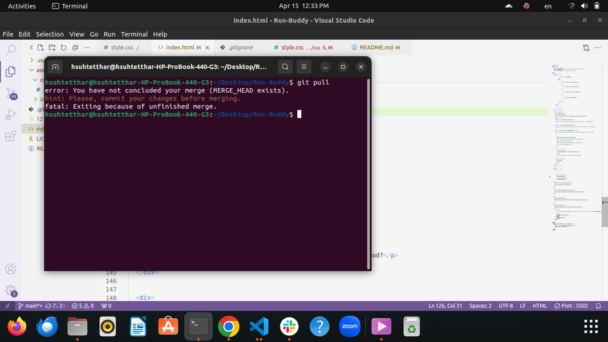
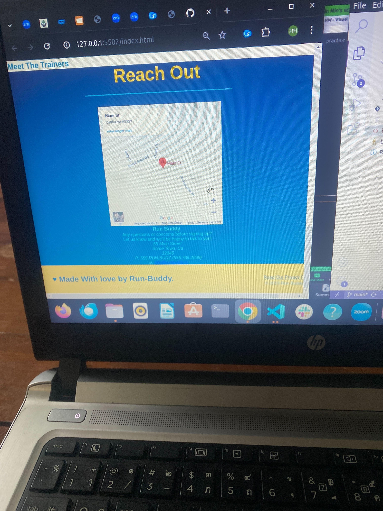

# Run-Buddy
## For(1.1)

## Header(1.1)
-h1,

-Nav (li)

-a tag

## Body(1.1)
-adding four section 

-h2

## Footer(1.1)
-h2

-a tag

-Div

-copy logo

### We only use index.html in (1.1)
### git problem(We don't get permission from github)
## For (1.2)
-universal selector (margin=0,padding=0)
## Header (1.2)
-paddding,bg color,width 100%

-h1 tag (text-decoration=none)

-display inline

-nav(float-right)

## Body(1.2)
-color

## Footer(1.2)

-div(float=right)

-bg color(yellow)

-width=100%
### We use index.html with css
### We get a little bit problem when we change the color.

## For 1.3 (AGGA)

-Inculding hero section
-We Added Label tag,Input tag,Button tag and 
 Form tag

### Photo downloading error.(we can't find original photo)

## For 1.4 (YAMIN THET & AGGA)

-what we do section
-what you do section
-adding 4 images
-span tag(in h3)
 
### spacing error e we s't do margin top.
### we use text-align (center) in css.
### github error

## For 1.5 (sein min)

##For 1.6 (hsu htet thar)

-iframe tag
-address tag
-a tag (using href mailto)

### css error 

